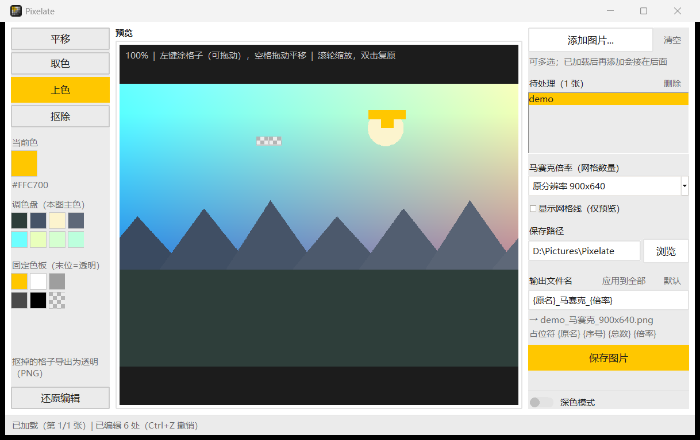

# Pixelate

把图片快速处理成马赛克（网格化）效果并导出，Windows 桌面小工具。

A small Windows desktop tool that turns any image into a mosaic look — queue
images, pick a grid size, tweak colors pixel-block by pixel-block, export PNG.



## 特点

- **待处理队列**：多选或拖入批量导入，加载后还能继续追加；列表点选切换、单张删除、清空
- **网格档位**：原分辨率（默认，网格数 = 像素尺寸，即不降采样）+ 16 / 24 / 32 / 48 / 64 / 96 / 128；
  新导入的图默认停在原分辨率，切图时保持你选的档
- **像素编辑**（左侧工具栏）：取色、上色、抠除透明，编辑按**马赛克块**为单位，Ctrl+Z 撤销/重做
- **每张独立命名**：命名模板支持 `{原名}` `{序号}` `{总数}` `{倍率}` 占位符，可一键应用到全部
- **所见即所得**：预览与导出共用同一条渲染管线，改了就是导出的
- **浅色/深色双主题**，侧栏底部一键切换并记住选择
- 滚轮缩放、拖拽平移、双击复原；单图直存、多图批量直存到指定目录（重名自动加 `(1)`）

## 运行

需要 Python 3.10+：

```bash
pip install pillow tkinterdnd2
python mosaic_app.py
```

`tkinterdnd2` 用来支持拖拽导入，缺了也能跑（只是不能拖）。

### 建桌面快捷方式（免打包，改完即生效）

```powershell
powershell -ExecutionPolicy Bypass -File make_shortcut.ps1
```

在桌面生成 `Pixelate.lnk`，指向 `pythonw.exe mosaic_app.py`（无控制台黑框），
图标指向 `icon.ico`。参数：`-Console` 用带黑框的 python（想看报错时）、`-Remove` 删除。

## 打包成 exe

```bash
pip install pyinstaller
pyinstaller --onefile --windowed --noconfirm --icon icon.ico ^
  --add-data "icon.ico;." --name Pixelate --collect-all tkinterdnd2 mosaic_app.py
```

`--add-data "icon.ico;."` 不能省：窗口图标是从外部 `icon.ico` 读的
（`wm iconbitmap` 在 Windows 上是空操作，代码里走的是 Win32 `WM_SETICON`）。

## 自测

```bash
python smoke_test.py             # 算法 + 配色对比度 + 命名模板 + 编辑补丁的单元断言
python mosaic_app.py --smoke-test # 起界面、来回切主题、自动退出
```

## 重新生成图标

```bash
python make_icon.py   # -> icon.ico（7 个尺寸）+ icon_preview.png
```

## 说明

- 导出统一为 PNG；用「抠除」扣掉的格子会导出为**真透明**
- 导入的 PNG 若本身带透明区，会**原样保留**（不会变成黑块），预览里同样显示为棋盘格
- 大图也流畅：绘制缓冲有上限，超出时自动降采样渲染，缩放/平移不会卡死
- **中键拖拽**在任意工具下都能平移（空格临时切换也行）
- 马赛克只改内容不改尺寸，导出分辨率与原图一致
- 在「原分辨率」档下，每个源像素就是一格，编辑相当于逐像素改（像素画模式）
- 马赛克后的 PNG 通常小很多（真实照片 4K 图在 16x16 下可从 3 MB 降到几十 KB）

## 许可

[MIT](LICENSE)